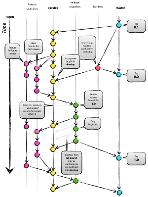
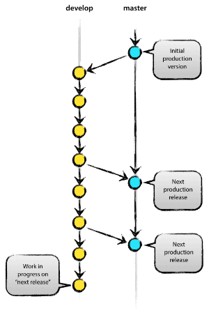
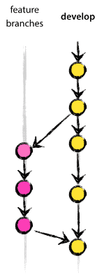
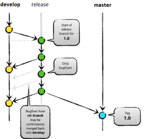
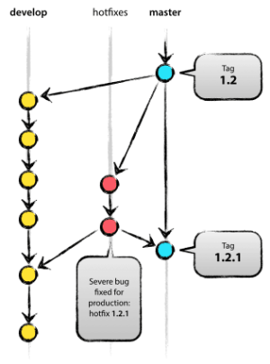

layout: true
class: center, middle, inverse

---
  

# Git Flow

       
### September 29, 2017
### ActiveCampaign

---
layout: false
class: middle

# Why a new Git model?

 
- Align our git branching model with our release process

	- Releasing to production multiple times a day -> periodic releases

	- Eliminate confusion about PR targets (`version-8.18`, `version-8.19` or `version-8.20`? help!)

	- Prevent branches getting out of sync
  
- Consistency across project repositories

---

## What is Git Flow?

.float-right[

]

 
- A strict branching model that helps teams manage a periodic versioned release cycle

- Builds upon a feature-branch workflow

- Assigns specific names and roles to branches
	- `develop`
	- `master`
	- `feature\*`
	- `release\*`
	- `hotfix\*`

- Defines how these branches interact

 
.footnote[Source: [A successful Git branching model](http://nvie.com/posts/a-successful-git-branching-model/), by Vincent Driessen (nvie)]

---

## Main branches

.float-right[

]

The workflow revolves around two main branches:

- `master`

	- Reflects what is currently in production

	- Records the release history of the project

	- Merges will be tagged, e.g. `v8.20.0`

- `develop`

	- Reflects the latest delivered changes ready for the next release

	- Serves as an integration branch for different features

	- The merge target for any finished feature work or non-critical bug fixes

---

## Feature branches

.float-right[

]
   

- Use for developing new features, large or small

- Branch from `develop`

- PRs target `develop`

- Feature branches may exist in the central repo to share with team, but will be deleted after merged into develop

- Feature branches *never* interact directly with `master`

---

## Release branches

.float-right[

]
  

- Use to start a new release

- Branch from `develop`

- Merge back into `master` and `develop`

- Named `release\*`, e.g. `release\8.20.0`

- A 'locked' branch for preparing a release

	- Smoke testing

	- Bug-fixes

	- Documentation, etc.

	- **No new features**

- Short-lived branch, deleted after it is merged

- `master` is tagged after release branch merged

---
# Git Flow

## Hotfix branches

.float-right[

]

 
- Use to quickly fix a critical issue in a production release

- Branch from `master`

- PRs target both `master` **and** `develop` (or `release\*`)

- Make separate PRs for merges into `master` and `develop`

- Master tagged with new version, e.g. `v8.20.1`

- Should be **rare** and only be used for fixing issues deemed **critical** by product managers and a dev lead will be involved

---
# Git Flow

## Summary

- `master` is production and `develop` is next release

- Feature work and non-critical bugs branch from and PRs target `develop`

- Hotfixes for critical bugs branch from `master` and target `master` and `develop` (or `release\*`)

- Releases branch from `develop` and will merge to `master` and back to `develop`

---
# Git Flow

## What's next?

- Git-flow CLI and GUI tools

- Still need Github forks?

- Staging environment and release branch deployments

- Keeping feature branches up-to-date

- Versions and database migrations

---

# Links

- [A successful Git branching model](http://nvie.com/posts/a-successful-git-branching-model/)

- [Hands-on examples  using Git Flow](https://activecampaign.quip.com/ik1TAlTGfVnc/Git-Flow-Example-Scenarios)

---
layout: true
class: center, middle, inverse
---

# Questions?
